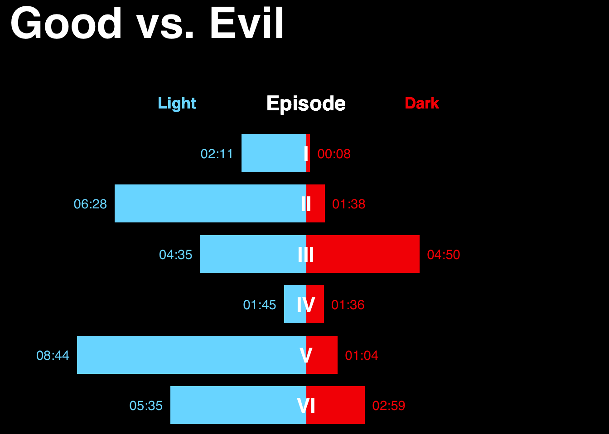
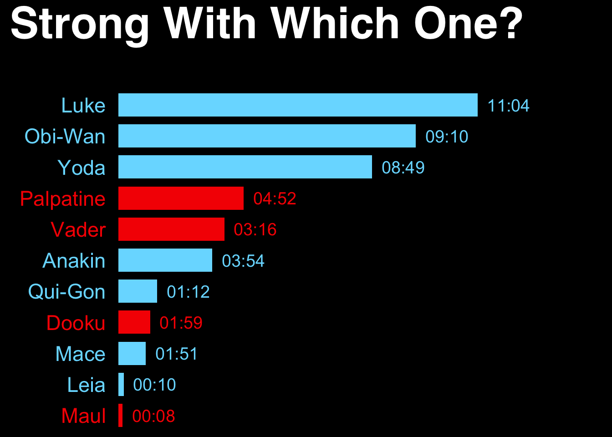

R pkg for <http://www.bloomberg.com/graphics/2015-star-wars-the-force-accounted/>

- `force_character()`:	force/character data
- `force_episode()`:	force/episode data
- `force_type()`:	force/type data
- `good_vs_evil()`:	good vs evil
- `mentions	mentions()`: data
- `strong_with_which_one()`:	strong with which one
- `timeline	timeline data()`:


```r
library(forceaccounted)
good_vs_evil()
```

 

```r
strong_with_which_one()
```

 
