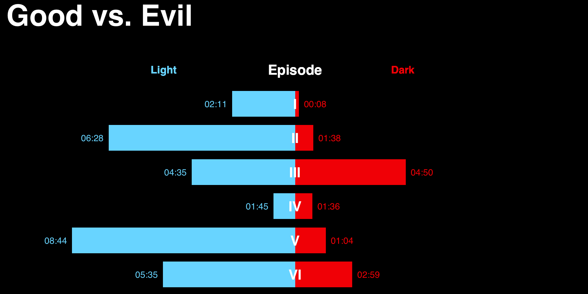
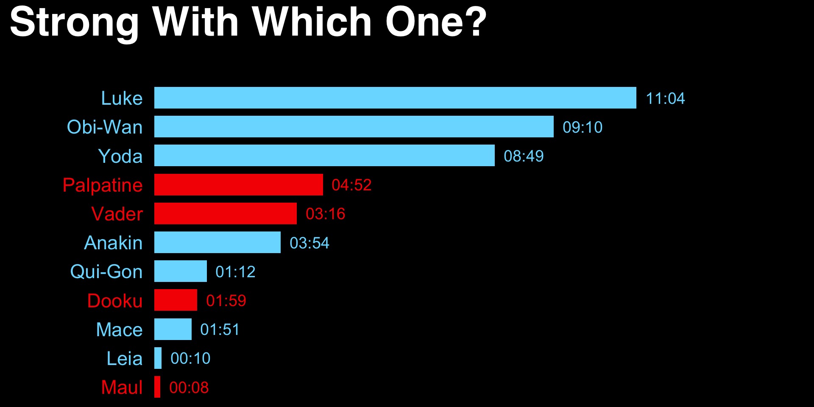

R pkg for <http://www.bloomberg.com/graphics/2015-star-wars-the-force-accounted/>

- `force_character()`:	force/character data
- `force_episode()`:	force/episode data
- `force_type()`:	force/type data
- `good_vs_evil()`:	good vs evil
- `mentions	mentions()`: data
- `strong_with_which_one()`:	strong with which one
- `timeline	timeline data()`:

Go [here](http://rud.is/projects/force_accounted.html) for a much nicer version of the stuff below.


```r
library(forceaccounted)
```


```r
good_vs_evil()
```

<div style="background:black">

</div>


```r
strong_with_which_one()
```

<div style="background:black">

</div>


```r
applied_force()
```

<div style="background:black">
<h1 style="color:white; padding:5px">Applied Force</h1>

</div>


```r
be_mentioned()
```

<div style="background:black">

</div>


```r
ebb_and_flow()
```

<div style="background:black">

</div>
